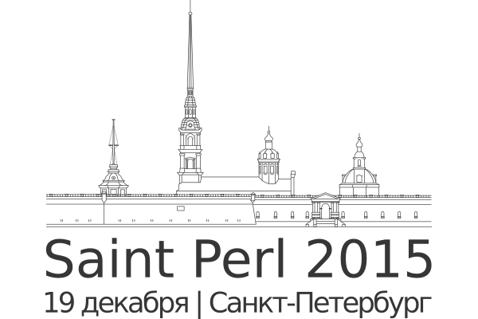

# Протокол HTTP/2. Зачем и как использовать в Perl

[Доклад](http://event.yapcrussia.org/saintperl7/talk/358) на Saint Perl 2015

## Просмотр веб-версии презентации

    $ cpanm App::remarkpl

    $ remarkpl http2_talk.markdown

Открываем в любимом браузере http://localhost:3000/

## PDF-версия

[remark - http2_talk.pdf](remark - http2_talk.pdf)
